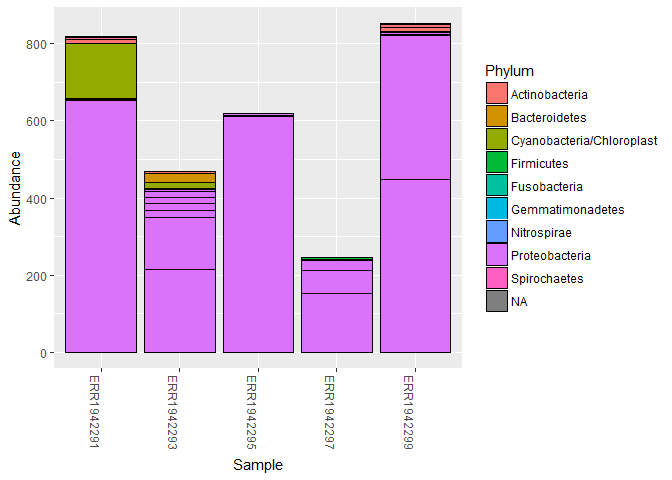

Analysis Report 1: Influence of sex on the diversity of hand surface bacteria.
================
Allison Bogisich
October 31, 2017

Introduction.
=============

Bacteria thrive not only within, but on almost every surface off the human body. Especially of interest is the microbiome maintained on the largest human organ: the skin. As such, it harbors one of the largest bacterial communities, and has vast potential to have significant impacts on one's health (Dethlefsen *et al.* (2007), Turnbaugh *et al.* (2007)). Skin is a complex habitat with both local and regional variations in not only amount of environmental exposure, but also the cellular make-up of the particular dermal variety (Fredricks (2001)). The great majority of these bacteria are not merely passive nor transient occupiers of the skin's surface, but instead are uniquely adapted for the particular niches made available in differing regions of the skin (Fierer *et al.* (2008)). Regions of frequent skin shedding, antimicrobial host defenses, and variance in the amount of exposure to soaps or detergents when cleansing, exposure to UV radiation, and availability of moisture sources are all factors that help to shape the microbial communities which can persist (Roth and James (1988), Cogen *et al.* (2008)).

The bacteria on skin surfaces appears to be highly diverse, however much of the diversity has not been extensively mapped. In addition to having difficulty in identifying the sheer number of bacterial species in a heterogeneous sample, certain culturing methods have shown that some taxa are specific to the skin environment and are difficult to grow in mono culture (Chiller *et al.* (2001)). Previous research has also observed consistent amounts of variability between individuals in the composition of their skin microbiomes (Gao *et al.* (2007), Grice *et al.* (2008)). Many questions still remain unanswered about the type of environmental and genetic factors that could be contributing to-or even driving-this variability.

With human DNA, it is highly conventional and relatively easy to determine biological gender based on chromosomal signature alone. Is it then entirely possible that our microbiomes carry a gender signature as well, since they are so intrinsically tied to us. In mice, stomach acid analyses have shown gender-specific differences as well as paralleled effects given gonad removal, providing support for mechanisms mediating sex differences in microbiota composition (Mehrabian *et al.* (2016)). Determining how much microbiota community structure is shaped by both environmental and particularly genetic factors, and which particular aspects are linked to each respective factor could have significant implications for the emerging field of bio-forensics.

Only within the past decade or so has the technical capability to sequence complex biological samples been able to take off to such an astounding extent. Recent developments in phylogenetic community analysis (Lozupone and Knight (2005)) with high-throughput pyrosequencing methods (Hamady *et al.* (2008)) have established the criteria for not only sequencing microbiome samples, but the very foundations of bacterial forensics. Fierer and his team have conducted a series of studies that demonstrate the strengths and weaknesses of the field (Fierer *et al.* (2010)). They found that skin-associated bacterial communities are surprisingly diverse, and that they are independently stable enough to assist traditional forensic evaluations.

Conventional methods of obtaining forensic results from human DNA require sufficient amounts of blood, tissue, semen, or saliva on an object. However, it is often difficult to obtain a large (and uncontaminated) enough sample to sequence. In order to boost standard results, recovering bacterial DNA from touched surfaces may be far easier, especially for identifying objects where clear fingerprints can't be obtained (e.g. fabrics, smudged surfaces, highly textured surfaces) (Fierer *et al.* (2008)). Given how abundant bacterial cells are on the surface of skin and on shed epidermal cells (Fredricks (2001)) and how highly personalized bacterial communities are implicates that more research is needed. In this post-analysis of Fierer's research, I now report the degree of sexual dimorphism that exists between male versus female subject's skin microbiomes from the aforementioned project. If a gender signature does exist in skin microbiomes, then I would predict that there will be marked differences in the bacterium making up sebum communities in each respective gender sampled.

Methods
=======

This post-experimental report is based on metadata output files from a BLAST search of trimmed and quality checked fasta files from the Fierer team study. The BLAST search matched swabbed and sequenced sebum samples against the GenBank database. Data used was from from NCBI Sequence Read Archive study number ERP022657, of which a summary of the information is available [here](https://www.ncbi.nlm.nih.gov/Traces/study/?WebEnv=NCID_1_128047291_130.14.22.33_5555_1505945515_1626731749_0MetA0_S_HStore&query_key=5). The metadata output process and the resulting files from this study can be found in a Github repository in a `data/metadata` directory available \[here\] <https://github.com/2017-usfca-cs-640/ABogisich-analysis-report-01-amplicons>. Using bioinformatic applications in R and R Studio, the metadata output from this repository were reorganized into subsets and transfigured into easily view-able figures to analyze and compare the diversity and potential sexual dimorphism of microbial fauna present on female and male subjects.

Sample origin and sequencing
----------------------------

Fierer and his team swabbed for skin-associated bacteria from different epidermal regions for each of their three studies. For the keyboard study, three participants were swabbed on the ventral surface of the distal joint of each fingertip. All individuals were healthy 20-35 year olds that had not taken antibiotics at least six months prior to swabbing. In the "storage" study, autoclaved cotton-tipped swabs moistened with sterile solution were again used, this time to sample the right axilary (armpit) skin surface sixteen times, from two healthy adults. Lastly, in the computer mouse study nine healthy adults were recruited (four female and five male, all 20-35 years of age) who worked in the same University of Colorado building. Using the swabbing technique outlined above, the entirety of the exposed surface of their dominant hand's palm (used to control the computer mice) were swabbed. Palm surfaces were sampled at midday and the participants had been following typical hand hygiene practices prior to sampling. Swabs were stored at -80 degrees before DNA extraction. The microbial communities on these participants were compared to a previously compiled database from 270 other hands sampled by Fierer and collaborators (Fierer *et al.* (2008); Costello *et al.* (2009)). The 270 hands in the database were from left and right palm surfaces belonging to an equal proportion of both healthy male and female volunteers, aged 18-40 years old.

Post DNA extraction from the samples, sequences were processed and analyzed using pyrosequencing procedures akin to Fierer's work in 2008. Sequences were removed if shorter than 200 bp or larger than 300 in length, had a quality score lower than 25, had ambiguous characters or uncorrectable barcodes, or if it did not contain the primer sequence.

Computational
-------------

The program R version 3.4.2 in conjunction with R Studio version 1.1.383 interface for Windows was used. Several general use packages from the R library were downloaded in order to utilize more specific exploratory data analysis functions. See listing under the code chunk "r load-libraries" for more detailed installation information. References can be found in the references.bib directory, as well as at the bottom of this report. Citations were organized and inserted using citr, accessible \[here\] <https://CRAN.R-project.org/package=citr>.

Primary packages used to clean and analyze the data were installed via bioconductor and devtools. The DADA2 package (Callahan *et al.*, 2016) was installed for use in conducting fast and accurate sample inferences from amplicon data with single-nucleotide resolution. Seqinr was used to export fastas of our final de-noised variants. Devtools was installed prior to downloading of mctoolsr, which stands for “microbial community analysis tools in R”. Created by Fierer, the intention of the package is to make it faster to manipulate data and perform certain analyses common to microbial community studies, while allowing us to easily access data using established functions (Leff, 2017). Phyloseq (McMurdie and Holmes, 2013) was the final package installed for my pipeline in order to visualize and quality check my results using tools `plot_bar`, `plot_richness`, `ploterrors` and `plotQualityProfile`.

Raw data was sorted for order and samples were extracted with their appropriate naming system. Base paths and full paths were set for the input and outputs of sample extraction. Quality checks were run prior to any data visualization to ensure that the lengths of the sequences being used were of proper length for obtaining quality scores above 30, which required filtering and trimming all sequences. Error models were also created to analyze each sample individually, and then visualized by plotting. Duplicated sequences and chimeras were then removed from the data set, so as not to compound error. `Seqinr` was used next to export the cleaned, trimmed, filtered, de-noised sequence variants so that I could build tables for use in making subset objects of data for desired visual graphics.

Results
=======

In addition to a minimum of 3-4 figures/tables (and associated captions), you should include sufficient text in this section to describe what your findings were. Remember that in the results section you just describe what you found, but you don't interpret it - that happens in the discussion.

``` r
# Be sure to install these packages before running this script
# They can be installed either with the intall.packages() function
# or with the 'Packages' pane in RStudio

# load general-use packages
library("dplyr")
library("tidyr")
library("knitr")
library("ggplot2")

# this package allows for the easy inclusion of literature citations in our Rmd
# more info here: https://github.com/crsh/citr
# and here:
# http://rmarkdown.rstudio.com/authoring_bibliographies_and_citations.html
library("citr")

# These are the primary packages well use to clean and analyze the data
# this package needs to be installed from bioconductor -- it's not on CRAN
# see info here: https://benjjneb.github.io/dada2/dada-installation.html
library("dada2")

# This to export a fasta of our final de-noised sequence variants
library("seqinr")

# To install this you have to install from GitHub
# See more info here: https://github.com/leffj/mctoolsr
# run this -- install.packages("devtools")
# and then this -- devtools::install_github("leffj/mctoolsr")
library("mctoolsr")

# And this to visualize our results
# it also needs to be installed from bioconductor
library("phyloseq")
```

``` r
# NOTE: Much of the following follows the DADA2 tutorials available here:
# https://benjjneb.github.io/dada2/tutorial.html
# Accessed October 19, 2017

# set the base path for our input data files
path <- "data/raw_data"

# Sort ensures samples are in order
filenames_forward_reads <- sort(list.files(path, pattern = ".fastq"))

# Extract sample names, assuming filenames have format: SAMPLENAME.fastq
sample_names <- sapply(strsplit(filenames_forward_reads, "\\."), `[`, 1)

# Specify the full path to each of the filenames_forward_reads
filenames_forward_reads <- file.path(path, filenames_forward_reads)
```

``` r
# Plots the quality profiles of all twenty samples
plotQualityProfile(filenames_forward_reads[1:20])
```


We can see from the quality profiles that most reads tend to get pretty bad in quality after around 200 bases. Therefore, we decided to set a maximum acceptable sequence length of 225 bases.

``` r
# Place filtered files in filtered/ subdirectory
# note this will fail if the directory doesn't exist
filter_path <- file.path("output", "filtered")
filtered_reads_path <- file.path(filter_path,
                                 paste0(sample_names,
                                        "_filt.fastq.gz"))

# See ?filterAndTrim for details on the parameters
# See here for adjustments for 454 data:
# https://benjjneb.github.io/dada2/
#     faq.html#can-i-use-dada2-with-my-454-or-ion-torrent-data
filtered_output <- filterAndTrim(fwd = filenames_forward_reads,
                                 filt = filtered_reads_path,
                                 maxLen = 225,
                                 maxN = 0, # discard any seqs with Ns
                                 maxEE = 3, # allow w/ up to 3 expected errors
                                 truncQ = 2, # cut off if quality gets this low
                                 rm.phix = TRUE,
                                 compress = TRUE,
                                 multithread = FALSE)
```

``` r
# produce nicely-formatted markdown table of read counts
# before/after trimming
kable(filtered_output,
      col.names = c("Reads In",
                    "Reads Out"))
```

|                  |  Reads In|  Reads Out|
|------------------|---------:|----------:|
| ERR1942280.fastq |       404|        350|
| ERR1942281.fastq |       422|        194|
| ERR1942282.fastq |       412|         31|
| ERR1942283.fastq |       791|        426|
| ERR1942284.fastq |       677|        525|
| ERR1942285.fastq |       443|         72|
| ERR1942286.fastq |       667|        617|
| ERR1942287.fastq |       590|        541|
| ERR1942288.fastq |       908|        877|
| ERR1942289.fastq |       372|        147|
| ERR1942290.fastq |       468|        249|
| ERR1942291.fastq |       933|        819|
| ERR1942292.fastq |       724|        709|
| ERR1942293.fastq |       811|        470|
| ERR1942294.fastq |       938|        552|
| ERR1942295.fastq |       705|        620|
| ERR1942296.fastq |       754|        441|
| ERR1942297.fastq |       275|        246|
| ERR1942298.fastq |       562|        389|
| ERR1942299.fastq |      1025|        852|

``` r
# this build error models from each of the samples
errors_forward_reads <- learnErrors(filtered_reads_path,
                                    multithread = FALSE)
```

    ## Not all sequences were the same length.
    ## Not all sequences were the same length.
    ## Not all sequences were the same length.
    ## Not all sequences were the same length.
    ## Not all sequences were the same length.
    ## Not all sequences were the same length.
    ## Not all sequences were the same length.
    ## Not all sequences were the same length.
    ## Not all sequences were the same length.
    ## Not all sequences were the same length.
    ## Not all sequences were the same length.
    ## Not all sequences were the same length.
    ## Not all sequences were the same length.
    ## Not all sequences were the same length.
    ## Not all sequences were the same length.
    ## Not all sequences were the same length.
    ## Not all sequences were the same length.
    ## Not all sequences were the same length.
    ## Not all sequences were the same length.
    ## Not all sequences were the same length.
    ## Initializing error rates to maximum possible estimate.
    ## Sample 1 - 350 reads in 72 unique sequences.
    ## Sample 2 - 194 reads in 163 unique sequences.
    ## Sample 3 - 31 reads in 25 unique sequences.
    ## Sample 4 - 426 reads in 176 unique sequences.
    ## Sample 5 - 525 reads in 134 unique sequences.
    ## Sample 6 - 72 reads in 65 unique sequences.
    ## Sample 7 - 617 reads in 178 unique sequences.
    ## Sample 8 - 541 reads in 135 unique sequences.
    ## Sample 9 - 877 reads in 201 unique sequences.
    ## Sample 10 - 147 reads in 107 unique sequences.
    ## Sample 11 - 249 reads in 181 unique sequences.
    ## Sample 12 - 819 reads in 212 unique sequences.
    ## Sample 13 - 709 reads in 128 unique sequences.
    ## Sample 14 - 470 reads in 171 unique sequences.
    ## Sample 15 - 552 reads in 250 unique sequences.
    ## Sample 16 - 620 reads in 141 unique sequences.
    ## Sample 17 - 441 reads in 186 unique sequences.
    ## Sample 18 - 246 reads in 88 unique sequences.
    ## Sample 19 - 389 reads in 332 unique sequences.
    ## Sample 20 - 852 reads in 239 unique sequences.
    ##    selfConsist step 2 
    ##    selfConsist step 3 
    ## Convergence after  3  rounds.
    ## Total reads used:  9127

``` r
# quick check to see if error models match data
# (black lines match black points) and are generally decresing left to right
plotErrors(errors_forward_reads,
           nominalQ = TRUE)
```

    ## Warning: Transformation introduced infinite values in continuous y-axis

    ## Warning: Transformation introduced infinite values in continuous y-axis


``` r
# get rid of any duplicated sequences
dereplicated_forward_reads <- derepFastq(filtered_reads_path,
                                         verbose = TRUE)
```

    ## Dereplicating sequence entries in Fastq file: output/filtered/ERR1942280_filt.fastq.gz

    ## Encountered 72 unique sequences from 350 total sequences read.

    ## Not all sequences were the same length.

    ## Dereplicating sequence entries in Fastq file: output/filtered/ERR1942281_filt.fastq.gz

    ## Encountered 163 unique sequences from 194 total sequences read.

    ## Not all sequences were the same length.

    ## Dereplicating sequence entries in Fastq file: output/filtered/ERR1942282_filt.fastq.gz

    ## Encountered 25 unique sequences from 31 total sequences read.

    ## Not all sequences were the same length.

    ## Dereplicating sequence entries in Fastq file: output/filtered/ERR1942283_filt.fastq.gz

    ## Encountered 176 unique sequences from 426 total sequences read.

    ## Not all sequences were the same length.

    ## Dereplicating sequence entries in Fastq file: output/filtered/ERR1942284_filt.fastq.gz

    ## Encountered 134 unique sequences from 525 total sequences read.

    ## Not all sequences were the same length.

    ## Dereplicating sequence entries in Fastq file: output/filtered/ERR1942285_filt.fastq.gz

    ## Encountered 65 unique sequences from 72 total sequences read.

    ## Not all sequences were the same length.

    ## Dereplicating sequence entries in Fastq file: output/filtered/ERR1942286_filt.fastq.gz

    ## Encountered 178 unique sequences from 617 total sequences read.

    ## Not all sequences were the same length.

    ## Dereplicating sequence entries in Fastq file: output/filtered/ERR1942287_filt.fastq.gz

    ## Encountered 135 unique sequences from 541 total sequences read.

    ## Not all sequences were the same length.

    ## Dereplicating sequence entries in Fastq file: output/filtered/ERR1942288_filt.fastq.gz

    ## Encountered 201 unique sequences from 877 total sequences read.

    ## Not all sequences were the same length.

    ## Dereplicating sequence entries in Fastq file: output/filtered/ERR1942289_filt.fastq.gz

    ## Encountered 107 unique sequences from 147 total sequences read.

    ## Not all sequences were the same length.

    ## Dereplicating sequence entries in Fastq file: output/filtered/ERR1942290_filt.fastq.gz

    ## Encountered 181 unique sequences from 249 total sequences read.

    ## Not all sequences were the same length.

    ## Dereplicating sequence entries in Fastq file: output/filtered/ERR1942291_filt.fastq.gz

    ## Encountered 212 unique sequences from 819 total sequences read.

    ## Not all sequences were the same length.

    ## Dereplicating sequence entries in Fastq file: output/filtered/ERR1942292_filt.fastq.gz

    ## Encountered 128 unique sequences from 709 total sequences read.

    ## Not all sequences were the same length.

    ## Dereplicating sequence entries in Fastq file: output/filtered/ERR1942293_filt.fastq.gz

    ## Encountered 171 unique sequences from 470 total sequences read.

    ## Not all sequences were the same length.

    ## Dereplicating sequence entries in Fastq file: output/filtered/ERR1942294_filt.fastq.gz

    ## Encountered 250 unique sequences from 552 total sequences read.

    ## Not all sequences were the same length.

    ## Dereplicating sequence entries in Fastq file: output/filtered/ERR1942295_filt.fastq.gz

    ## Encountered 141 unique sequences from 620 total sequences read.

    ## Not all sequences were the same length.

    ## Dereplicating sequence entries in Fastq file: output/filtered/ERR1942296_filt.fastq.gz

    ## Encountered 186 unique sequences from 441 total sequences read.

    ## Not all sequences were the same length.

    ## Dereplicating sequence entries in Fastq file: output/filtered/ERR1942297_filt.fastq.gz

    ## Encountered 88 unique sequences from 246 total sequences read.

    ## Not all sequences were the same length.

    ## Dereplicating sequence entries in Fastq file: output/filtered/ERR1942298_filt.fastq.gz

    ## Encountered 332 unique sequences from 389 total sequences read.

    ## Not all sequences were the same length.

    ## Dereplicating sequence entries in Fastq file: output/filtered/ERR1942299_filt.fastq.gz

    ## Encountered 239 unique sequences from 852 total sequences read.

    ## Not all sequences were the same length.

``` r
# Name the derep-class objects by the sample names
names(dereplicated_forward_reads) <- sample_names
```

``` r
# parameters adjusted based on recommendations for 454 data here:
# https://benjjneb.github.io/dada2/
#     faq.html#can-i-use-dada2-with-my-454-or-ion-torrent-data
dada_forward_reads <- dada(dereplicated_forward_reads,
                           err = errors_forward_reads,
                           HOMOPOLYMER_GAP_PENALTY = -1, # reduce penalty bc 454
                           BAND_SIZE = 32) # performs local alignments bc indels
```

    ## Sample 1 - 350 reads in 72 unique sequences.
    ## Sample 2 - 194 reads in 163 unique sequences.
    ## Sample 3 - 31 reads in 25 unique sequences.
    ## Sample 4 - 426 reads in 176 unique sequences.
    ## Sample 5 - 525 reads in 134 unique sequences.
    ## Sample 6 - 72 reads in 65 unique sequences.
    ## Sample 7 - 617 reads in 178 unique sequences.
    ## Sample 8 - 541 reads in 135 unique sequences.
    ## Sample 9 - 877 reads in 201 unique sequences.
    ## Sample 10 - 147 reads in 107 unique sequences.
    ## Sample 11 - 249 reads in 181 unique sequences.
    ## Sample 12 - 819 reads in 212 unique sequences.
    ## Sample 13 - 709 reads in 128 unique sequences.
    ## Sample 14 - 470 reads in 171 unique sequences.
    ## Sample 15 - 552 reads in 250 unique sequences.
    ## Sample 16 - 620 reads in 141 unique sequences.
    ## Sample 17 - 441 reads in 186 unique sequences.
    ## Sample 18 - 246 reads in 88 unique sequences.
    ## Sample 19 - 389 reads in 332 unique sequences.
    ## Sample 20 - 852 reads in 239 unique sequences.

``` r
# check dada results
dada_forward_reads
```

    ## $ERR1942280
    ## dada-class: object describing DADA2 denoising results
    ## 3 sample sequences were inferred from 72 input unique sequences.
    ## Key parameters: OMEGA_A = 1e-40, BAND_SIZE = 32, USE_QUALS = TRUE
    ## 
    ## $ERR1942281
    ## dada-class: object describing DADA2 denoising results
    ## 18 sample sequences were inferred from 163 input unique sequences.
    ## Key parameters: OMEGA_A = 1e-40, BAND_SIZE = 32, USE_QUALS = TRUE
    ## 
    ## $ERR1942282
    ## dada-class: object describing DADA2 denoising results
    ## 3 sample sequences were inferred from 25 input unique sequences.
    ## Key parameters: OMEGA_A = 1e-40, BAND_SIZE = 32, USE_QUALS = TRUE
    ## 
    ## $ERR1942283
    ## dada-class: object describing DADA2 denoising results
    ## 17 sample sequences were inferred from 176 input unique sequences.
    ## Key parameters: OMEGA_A = 1e-40, BAND_SIZE = 32, USE_QUALS = TRUE
    ## 
    ## $ERR1942284
    ## dada-class: object describing DADA2 denoising results
    ## 4 sample sequences were inferred from 134 input unique sequences.
    ## Key parameters: OMEGA_A = 1e-40, BAND_SIZE = 32, USE_QUALS = TRUE
    ## 
    ## $ERR1942285
    ## dada-class: object describing DADA2 denoising results
    ## 7 sample sequences were inferred from 65 input unique sequences.
    ## Key parameters: OMEGA_A = 1e-40, BAND_SIZE = 32, USE_QUALS = TRUE
    ## 
    ## $ERR1942286
    ## dada-class: object describing DADA2 denoising results
    ## 8 sample sequences were inferred from 178 input unique sequences.
    ## Key parameters: OMEGA_A = 1e-40, BAND_SIZE = 32, USE_QUALS = TRUE
    ## 
    ## $ERR1942287
    ## dada-class: object describing DADA2 denoising results
    ## 5 sample sequences were inferred from 135 input unique sequences.
    ## Key parameters: OMEGA_A = 1e-40, BAND_SIZE = 32, USE_QUALS = TRUE
    ## 
    ## $ERR1942288
    ## dada-class: object describing DADA2 denoising results
    ## 5 sample sequences were inferred from 201 input unique sequences.
    ## Key parameters: OMEGA_A = 1e-40, BAND_SIZE = 32, USE_QUALS = TRUE
    ## 
    ## $ERR1942289
    ## dada-class: object describing DADA2 denoising results
    ## 17 sample sequences were inferred from 107 input unique sequences.
    ## Key parameters: OMEGA_A = 1e-40, BAND_SIZE = 32, USE_QUALS = TRUE
    ## 
    ## $ERR1942290
    ## dada-class: object describing DADA2 denoising results
    ## 13 sample sequences were inferred from 181 input unique sequences.
    ## Key parameters: OMEGA_A = 1e-40, BAND_SIZE = 32, USE_QUALS = TRUE
    ## 
    ## $ERR1942291
    ## dada-class: object describing DADA2 denoising results
    ## 8 sample sequences were inferred from 212 input unique sequences.
    ## Key parameters: OMEGA_A = 1e-40, BAND_SIZE = 32, USE_QUALS = TRUE
    ## 
    ## $ERR1942292
    ## dada-class: object describing DADA2 denoising results
    ## 3 sample sequences were inferred from 128 input unique sequences.
    ## Key parameters: OMEGA_A = 1e-40, BAND_SIZE = 32, USE_QUALS = TRUE
    ## 
    ## $ERR1942293
    ## dada-class: object describing DADA2 denoising results
    ## 11 sample sequences were inferred from 171 input unique sequences.
    ## Key parameters: OMEGA_A = 1e-40, BAND_SIZE = 32, USE_QUALS = TRUE
    ## 
    ## $ERR1942294
    ## dada-class: object describing DADA2 denoising results
    ## 30 sample sequences were inferred from 250 input unique sequences.
    ## Key parameters: OMEGA_A = 1e-40, BAND_SIZE = 32, USE_QUALS = TRUE
    ## 
    ## $ERR1942295
    ## dada-class: object describing DADA2 denoising results
    ## 4 sample sequences were inferred from 141 input unique sequences.
    ## Key parameters: OMEGA_A = 1e-40, BAND_SIZE = 32, USE_QUALS = TRUE
    ## 
    ## $ERR1942296
    ## dada-class: object describing DADA2 denoising results
    ## 17 sample sequences were inferred from 186 input unique sequences.
    ## Key parameters: OMEGA_A = 1e-40, BAND_SIZE = 32, USE_QUALS = TRUE
    ## 
    ## $ERR1942297
    ## dada-class: object describing DADA2 denoising results
    ## 5 sample sequences were inferred from 88 input unique sequences.
    ## Key parameters: OMEGA_A = 1e-40, BAND_SIZE = 32, USE_QUALS = TRUE
    ## 
    ## $ERR1942298
    ## dada-class: object describing DADA2 denoising results
    ## 21 sample sequences were inferred from 332 input unique sequences.
    ## Key parameters: OMEGA_A = 1e-40, BAND_SIZE = 32, USE_QUALS = TRUE
    ## 
    ## $ERR1942299
    ## dada-class: object describing DADA2 denoising results
    ## 8 sample sequences were inferred from 239 input unique sequences.
    ## Key parameters: OMEGA_A = 1e-40, BAND_SIZE = 32, USE_QUALS = TRUE

``` r
# produce the 'site by species matrix'
sequence_table <- makeSequenceTable(dada_forward_reads)
```

    ## The sequences being tabled vary in length.

The output table has 20 rows (samples) and 178 columns (sequence variants). Notice how we can embed R code directly in our markdown text.

``` r
# Quick check to look at distribution of trimmed and denoised sequences
hist(nchar(getSequences(sequence_table)),
     main = "Histogram of fingal sequence variant lengths",
     xlab = "Sequence length in bp")
```


``` r
# Check for and remove chimeras
sequence_table_nochim <- removeBimeraDenovo(sequence_table,
                                            method = "consensus",
                                            multithread = FALSE,
                                            verbose = TRUE)
```

    ## Identified 0 bimeras out of 178 input sequences.

``` r
# What percent of our reads are non-chimeric?
non_chimeric_reads <- round(sum(sequence_table_nochim) / sum(sequence_table),
                            digits = 4) * 100
```

After removing chimeras, we were left with 100% of our cleaned reads.

``` r
# Build a table showing how many sequences remain at each step of the pipeline
get_n <- function(x) sum(getUniques(x)) # make a quick function
track <- cbind(filtered_output, # already has 2 columns
               sapply(dada_forward_reads, get_n),
               rowSums(sequence_table),
               rowSums(sequence_table_nochim))

# add nice meaningful column names
colnames(track) <- c("Input",
                     "Filtered",
                     "Denoised",
                     "Sequence Table",
                     "Non-chimeric")

# set the proper rownames
rownames(track) <- sample_names

# produce nice markdown table of progress through the pipeline
kable(track)
```

|            |  Input|  Filtered|  Denoised|  Sequence Table|  Non-chimeric|
|------------|------:|---------:|---------:|---------------:|-------------:|
| ERR1942280 |    404|       350|       350|             350|           350|
| ERR1942281 |    422|       194|       194|             194|           194|
| ERR1942282 |    412|        31|        31|              31|            31|
| ERR1942283 |    791|       426|       426|             426|           426|
| ERR1942284 |    677|       525|       525|             525|           525|
| ERR1942285 |    443|        72|        72|              72|            72|
| ERR1942286 |    667|       617|       617|             617|           617|
| ERR1942287 |    590|       541|       541|             541|           541|
| ERR1942288 |    908|       877|       877|             877|           877|
| ERR1942289 |    372|       147|       147|             147|           147|
| ERR1942290 |    468|       249|       249|             249|           249|
| ERR1942291 |    933|       819|       819|             819|           819|
| ERR1942292 |    724|       709|       709|             709|           709|
| ERR1942293 |    811|       470|       470|             470|           470|
| ERR1942294 |    938|       552|       552|             552|           552|
| ERR1942295 |    705|       620|       620|             620|           620|
| ERR1942296 |    754|       441|       441|             441|           441|
| ERR1942297 |    275|       246|       246|             246|           246|
| ERR1942298 |    562|       389|       389|             389|           389|
| ERR1942299 |   1025|       852|       852|             852|           852|

``` r
# assigns taxonomy to each sequence variant based on a supplied training set
# made up of known sequences
taxa <- assignTaxonomy(sequence_table_nochim,
                       "data/training/rdp_train_set_16.fa.gz",
                       multithread = FALSE,
                       tryRC = TRUE) # also check with seq reverse compliments

# show the results of the taxonomy assignment
unname(taxa)
```

    ##        [,1]       [,2]                        [,3]                 
    ##   [1,] "Bacteria" "Proteobacteria"            NA                   
    ##   [2,] "Bacteria" "Proteobacteria"            "Alphaproteobacteria"
    ##   [3,] "Bacteria" "Bacteroidetes"             NA                   
    ##   [4,] "Bacteria" "Proteobacteria"            NA                   
    ##   [5,] "Bacteria" "Proteobacteria"            "Betaproteobacteria" 
    ##   [6,] "Bacteria" "Cyanobacteria/Chloroplast" "Chloroplast"        
    ##   [7,] "Bacteria" "Proteobacteria"            "Betaproteobacteria" 
    ##   [8,] "Bacteria" "Bacteroidetes"             "Cytophagia"         
    ##   [9,] "Bacteria" "Proteobacteria"            "Alphaproteobacteria"
    ##  [10,] "Bacteria" "Proteobacteria"            "Betaproteobacteria" 
    ##  [11,] "Bacteria" "Proteobacteria"            NA                   
    ##  [12,] "Bacteria" "Actinobacteria"            "Actinobacteria"     
    ##  [13,] "Bacteria" "Cyanobacteria/Chloroplast" "Chloroplast"        
    ##  [14,] "Bacteria" "Proteobacteria"            "Betaproteobacteria" 
    ##  [15,] "Bacteria" "Proteobacteria"            "Betaproteobacteria" 
    ##  [16,] "Bacteria" "Proteobacteria"            NA                   
    ##  [17,] "Bacteria" "Bacteroidetes"             "Flavobacteriia"     
    ##  [18,] "Bacteria" "Firmicutes"                "Clostridia"         
    ##  [19,] "Bacteria" NA                          NA                   
    ##  [20,] "Bacteria" "Proteobacteria"            "Betaproteobacteria" 
    ##  [21,] "Bacteria" "Firmicutes"                "Clostridia"         
    ##  [22,] "Bacteria" "Firmicutes"                "Clostridia"         
    ##  [23,] "Bacteria" "Firmicutes"                "Clostridia"         
    ##  [24,] "Bacteria" "Firmicutes"                "Clostridia"         
    ##  [25,] "Bacteria" "Proteobacteria"            "Betaproteobacteria" 
    ##  [26,] "Bacteria" "Cyanobacteria/Chloroplast" "Chloroplast"        
    ##  [27,] "Bacteria" "Firmicutes"                "Clostridia"         
    ##  [28,] "Bacteria" "Firmicutes"                "Clostridia"         
    ##  [29,] "Bacteria" "Actinobacteria"            "Actinobacteria"     
    ##  [30,] "Bacteria" "Proteobacteria"            "Alphaproteobacteria"
    ##  [31,] "Bacteria" "Actinobacteria"            "Actinobacteria"     
    ##  [32,] "Bacteria" "Actinobacteria"            "Actinobacteria"     
    ##  [33,] "Bacteria" "Actinobacteria"            "Actinobacteria"     
    ##  [34,] "Bacteria" "Proteobacteria"            NA                   
    ##  [35,] "Bacteria" "Actinobacteria"            "Actinobacteria"     
    ##  [36,] "Bacteria" "Firmicutes"                "Clostridia"         
    ##  [37,] "Bacteria" "Proteobacteria"            "Betaproteobacteria" 
    ##  [38,] "Bacteria" "Proteobacteria"            "Alphaproteobacteria"
    ##  [39,] "Bacteria" "Actinobacteria"            "Actinobacteria"     
    ##  [40,] "Bacteria" "Cyanobacteria/Chloroplast" "Chloroplast"        
    ##  [41,] "Bacteria" "Proteobacteria"            "Betaproteobacteria" 
    ##  [42,] "Bacteria" "Bacteroidetes"             "Flavobacteriia"     
    ##  [43,] "Bacteria" "Firmicutes"                "Bacilli"            
    ##  [44,] "Bacteria" "Firmicutes"                "Clostridia"         
    ##  [45,] "Bacteria" "Proteobacteria"            NA                   
    ##  [46,] "Bacteria" "Firmicutes"                "Clostridia"         
    ##  [47,] "Bacteria" "Proteobacteria"            "Gammaproteobacteria"
    ##  [48,] "Bacteria" "Firmicutes"                "Clostridia"         
    ##  [49,] "Bacteria" "Actinobacteria"            "Actinobacteria"     
    ##  [50,] "Bacteria" "Firmicutes"                "Clostridia"         
    ##  [51,] "Bacteria" "Proteobacteria"            "Betaproteobacteria" 
    ##  [52,] "Bacteria" "Actinobacteria"            "Actinobacteria"     
    ##  [53,] "Bacteria" "Actinobacteria"            "Actinobacteria"     
    ##  [54,] "Bacteria" "Actinobacteria"            "Actinobacteria"     
    ##  [55,] "Bacteria" "Actinobacteria"            "Actinobacteria"     
    ##  [56,] "Bacteria" "Proteobacteria"            "Alphaproteobacteria"
    ##  [57,] "Bacteria" "Firmicutes"                NA                   
    ##  [58,] "Bacteria" "Actinobacteria"            "Actinobacteria"     
    ##  [59,] "Bacteria" "Firmicutes"                "Clostridia"         
    ##  [60,] "Bacteria" "Proteobacteria"            "Gammaproteobacteria"
    ##  [61,] "Bacteria" NA                          NA                   
    ##  [62,] "Bacteria" "Firmicutes"                "Clostridia"         
    ##  [63,] "Bacteria" "Firmicutes"                "Clostridia"         
    ##  [64,] "Bacteria" "Firmicutes"                "Clostridia"         
    ##  [65,] "Bacteria" "Proteobacteria"            "Alphaproteobacteria"
    ##  [66,] "Bacteria" "Firmicutes"                "Clostridia"         
    ##  [67,] "Bacteria" "Actinobacteria"            "Actinobacteria"     
    ##  [68,] "Bacteria" "Actinobacteria"            "Actinobacteria"     
    ##  [69,] "Bacteria" "Actinobacteria"            "Actinobacteria"     
    ##  [70,] "Bacteria" "Proteobacteria"            "Alphaproteobacteria"
    ##  [71,] "Bacteria" "Firmicutes"                "Clostridia"         
    ##  [72,] "Bacteria" "Proteobacteria"            "Alphaproteobacteria"
    ##  [73,] "Bacteria" "Firmicutes"                "Clostridia"         
    ##  [74,] "Bacteria" "Proteobacteria"            "Betaproteobacteria" 
    ##  [75,] "Bacteria" "Firmicutes"                "Clostridia"         
    ##  [76,] "Bacteria" "Actinobacteria"            "Actinobacteria"     
    ##  [77,] "Bacteria" "Cyanobacteria/Chloroplast" "Chloroplast"        
    ##  [78,] "Bacteria" "Firmicutes"                "Clostridia"         
    ##  [79,] "Bacteria" "Actinobacteria"            "Actinobacteria"     
    ##  [80,] "Bacteria" "Actinobacteria"            "Actinobacteria"     
    ##  [81,] "Bacteria" "Actinobacteria"            "Actinobacteria"     
    ##  [82,] "Bacteria" "Firmicutes"                "Clostridia"         
    ##  [83,] "Bacteria" "Bacteroidetes"             "Flavobacteriia"     
    ##  [84,] "Bacteria" "Actinobacteria"            "Actinobacteria"     
    ##  [85,] "Bacteria" "Proteobacteria"            "Alphaproteobacteria"
    ##  [86,] "Bacteria" "Firmicutes"                "Clostridia"         
    ##  [87,] "Bacteria" "Proteobacteria"            "Betaproteobacteria" 
    ##  [88,] "Bacteria" "Proteobacteria"            "Alphaproteobacteria"
    ##  [89,] "Bacteria" "Cyanobacteria/Chloroplast" "Chloroplast"        
    ##  [90,] "Bacteria" "Firmicutes"                "Clostridia"         
    ##  [91,] "Bacteria" "Firmicutes"                "Clostridia"         
    ##  [92,] "Bacteria" "Proteobacteria"            "Gammaproteobacteria"
    ##  [93,] "Bacteria" "Proteobacteria"            "Betaproteobacteria" 
    ##  [94,] "Bacteria" "Gemmatimonadetes"          "Gemmatimonadetes"   
    ##  [95,] "Bacteria" "Actinobacteria"            "Actinobacteria"     
    ##  [96,] "Bacteria" "Proteobacteria"            "Betaproteobacteria" 
    ##  [97,] "Bacteria" "Firmicutes"                "Bacilli"            
    ##  [98,] "Bacteria" "Firmicutes"                "Clostridia"         
    ##  [99,] "Bacteria" "Actinobacteria"            "Actinobacteria"     
    ## [100,] "Bacteria" "Proteobacteria"            NA                   
    ## [101,] "Bacteria" "Actinobacteria"            "Actinobacteria"     
    ## [102,] "Bacteria" "Actinobacteria"            "Actinobacteria"     
    ## [103,] "Bacteria" "Firmicutes"                "Clostridia"         
    ## [104,] "Bacteria" "Firmicutes"                "Clostridia"         
    ## [105,] "Bacteria" "Firmicutes"                "Clostridia"         
    ## [106,] "Bacteria" "Actinobacteria"            "Actinobacteria"     
    ## [107,] "Bacteria" "Firmicutes"                "Clostridia"         
    ## [108,] "Bacteria" NA                          NA                   
    ## [109,] "Bacteria" "Firmicutes"                "Clostridia"         
    ## [110,] "Bacteria" "Bacteroidetes"             "Sphingobacteriia"   
    ## [111,] "Bacteria" "Firmicutes"                "Bacilli"            
    ## [112,] "Bacteria" "Gemmatimonadetes"          "Gemmatimonadetes"   
    ## [113,] "Bacteria" "Actinobacteria"            "Actinobacteria"     
    ## [114,] "Bacteria" "Firmicutes"                "Bacilli"            
    ## [115,] "Bacteria" "Bacteroidetes"             "Sphingobacteriia"   
    ## [116,] "Bacteria" "Firmicutes"                "Clostridia"         
    ## [117,] "Bacteria" "Firmicutes"                "Clostridia"         
    ## [118,] "Bacteria" "Actinobacteria"            "Actinobacteria"     
    ## [119,] "Bacteria" "Proteobacteria"            "Alphaproteobacteria"
    ## [120,] "Bacteria" "Firmicutes"                "Clostridia"         
    ## [121,] "Bacteria" "Firmicutes"                "Clostridia"         
    ## [122,] "Bacteria" "Proteobacteria"            "Alphaproteobacteria"
    ## [123,] "Bacteria" "Firmicutes"                "Clostridia"         
    ## [124,] "Bacteria" "Actinobacteria"            "Actinobacteria"     
    ## [125,] "Bacteria" "Actinobacteria"            "Actinobacteria"     
    ## [126,] "Bacteria" "Firmicutes"                "Bacilli"            
    ## [127,] "Bacteria" "Firmicutes"                "Clostridia"         
    ## [128,] "Bacteria" "Firmicutes"                "Bacilli"            
    ## [129,] "Bacteria" "Firmicutes"                "Clostridia"         
    ## [130,] "Bacteria" "Proteobacteria"            "Alphaproteobacteria"
    ## [131,] "Bacteria" "Proteobacteria"            "Alphaproteobacteria"
    ## [132,] "Bacteria" "Spirochaetes"              "Spirochaetia"       
    ## [133,] "Bacteria" "Firmicutes"                "Clostridia"         
    ## [134,] "Bacteria" "Firmicutes"                "Clostridia"         
    ## [135,] "Bacteria" NA                          NA                   
    ## [136,] "Bacteria" "Firmicutes"                NA                   
    ## [137,] "Bacteria" "Proteobacteria"            "Gammaproteobacteria"
    ## [138,] "Bacteria" "Firmicutes"                "Clostridia"         
    ## [139,] "Bacteria" "Proteobacteria"            "Alphaproteobacteria"
    ## [140,] "Bacteria" "Proteobacteria"            "Alphaproteobacteria"
    ## [141,] "Bacteria" "Firmicutes"                "Clostridia"         
    ## [142,] "Bacteria" "Proteobacteria"            "Betaproteobacteria" 
    ## [143,] "Bacteria" "Firmicutes"                "Erysipelotrichia"   
    ## [144,] "Bacteria" "Actinobacteria"            "Actinobacteria"     
    ## [145,] "Bacteria" "Firmicutes"                "Clostridia"         
    ## [146,] "Bacteria" "Actinobacteria"            "Actinobacteria"     
    ## [147,] "Bacteria" "Firmicutes"                "Clostridia"         
    ## [148,] "Bacteria" "Actinobacteria"            "Actinobacteria"     
    ## [149,] "Bacteria" "Firmicutes"                "Clostridia"         
    ## [150,] "Bacteria" "Bacteroidetes"             "Sphingobacteriia"   
    ## [151,] "Bacteria" "Firmicutes"                "Clostridia"         
    ## [152,] "Bacteria" "Proteobacteria"            "Alphaproteobacteria"
    ## [153,] "Bacteria" "Actinobacteria"            "Actinobacteria"     
    ## [154,] "Bacteria" "Firmicutes"                "Clostridia"         
    ## [155,] "Bacteria" "Bacteroidetes"             "Bacteroidia"        
    ## [156,] "Bacteria" NA                          NA                   
    ## [157,] "Bacteria" "Proteobacteria"            NA                   
    ## [158,] "Bacteria" "Firmicutes"                "Clostridia"         
    ## [159,] "Bacteria" "Firmicutes"                "Clostridia"         
    ## [160,] "Bacteria" "Firmicutes"                "Clostridia"         
    ## [161,] "Bacteria" "Firmicutes"                "Bacilli"            
    ## [162,] "Bacteria" "Bacteroidetes"             "Flavobacteriia"     
    ## [163,] "Bacteria" "Fusobacteria"              "Fusobacteriia"      
    ## [164,] "Bacteria" "Firmicutes"                "Clostridia"         
    ## [165,] "Bacteria" "Firmicutes"                "Bacilli"            
    ## [166,] "Bacteria" "Firmicutes"                "Clostridia"         
    ## [167,] "Bacteria" "Nitrospirae"               "Nitrospira"         
    ## [168,] "Bacteria" NA                          NA                   
    ## [169,] "Bacteria" "Firmicutes"                "Bacilli"            
    ## [170,] "Bacteria" "Proteobacteria"            "Betaproteobacteria" 
    ## [171,] "Bacteria" "Bacteroidetes"             "Sphingobacteriia"   
    ## [172,] "Bacteria" "Actinobacteria"            "Actinobacteria"     
    ## [173,] "Bacteria" "Proteobacteria"            "Alphaproteobacteria"
    ## [174,] "Bacteria" "Firmicutes"                "Clostridia"         
    ## [175,] "Bacteria" "Firmicutes"                "Clostridia"         
    ## [176,] "Bacteria" "Actinobacteria"            "Actinobacteria"     
    ## [177,] "Bacteria" "Proteobacteria"            "Gammaproteobacteria"
    ## [178,] "Bacteria" "Actinobacteria"            "Actinobacteria"     
    ##        [,4]                 [,5]                  
    ##   [1,] NA                   NA                    
    ##   [2,] "Rhizobiales"        "Bartonellaceae"      
    ##   [3,] NA                   NA                    
    ##   [4,] NA                   NA                    
    ##   [5,] "Neisseriales"       "Neisseriaceae"       
    ##   [6,] "Chloroplast"        "Streptophyta"        
    ##   [7,] "Burkholderiales"    "Comamonadaceae"      
    ##   [8,] "Cytophagales"       NA                    
    ##   [9,] "Rhizobiales"        "Bartonellaceae"      
    ##  [10,] "Burkholderiales"    "Oxalobacteraceae"    
    ##  [11,] NA                   NA                    
    ##  [12,] "Actinomycetales"    "Nocardiaceae"        
    ##  [13,] "Chloroplast"        "Streptophyta"        
    ##  [14,] "Burkholderiales"    "Oxalobacteraceae"    
    ##  [15,] "Neisseriales"       "Neisseriaceae"       
    ##  [16,] NA                   NA                    
    ##  [17,] "Flavobacteriales"   "Flavobacteriaceae"   
    ##  [18,] "Clostridiales"      "Lachnospiraceae"     
    ##  [19,] NA                   NA                    
    ##  [20,] "Burkholderiales"    "Comamonadaceae"      
    ##  [21,] "Clostridiales"      "Ruminococcaceae"     
    ##  [22,] "Clostridiales"      "Ruminococcaceae"     
    ##  [23,] "Clostridiales"      "Ruminococcaceae"     
    ##  [24,] "Clostridiales"      "Lachnospiraceae"     
    ##  [25,] "Burkholderiales"    "Comamonadaceae"      
    ##  [26,] "Chloroplast"        "Streptophyta"        
    ##  [27,] "Clostridiales"      "Ruminococcaceae"     
    ##  [28,] "Clostridiales"      NA                    
    ##  [29,] "Actinomycetales"    "Streptomycetaceae"   
    ##  [30,] "Sphingomonadales"   "Sphingomonadaceae"   
    ##  [31,] "Actinomycetales"    "Nocardioidaceae"     
    ##  [32,] "Actinomycetales"    "Streptomycetaceae"   
    ##  [33,] "Actinomycetales"    "Microbacteriaceae"   
    ##  [34,] NA                   NA                    
    ##  [35,] "Actinomycetales"    "Streptomycetaceae"   
    ##  [36,] "Clostridiales"      "Ruminococcaceae"     
    ##  [37,] "Methylophilales"    "Methylophilaceae"    
    ##  [38,] "Sphingomonadales"   "Sphingomonadaceae"   
    ##  [39,] "Actinomycetales"    "Intrasporangiaceae"  
    ##  [40,] "Chloroplast"        "Streptophyta"        
    ##  [41,] "Rhodocyclales"      "Rhodocyclaceae"      
    ##  [42,] "Flavobacteriales"   "Flavobacteriaceae"   
    ##  [43,] "Lactobacillales"    "Streptococcaceae"    
    ##  [44,] "Clostridiales"      NA                    
    ##  [45,] NA                   NA                    
    ##  [46,] "Clostridiales"      "Ruminococcaceae"     
    ##  [47,] "Pseudomonadales"    "Pseudomonadaceae"    
    ##  [48,] "Clostridiales"      "Lachnospiraceae"     
    ##  [49,] "Actinomycetales"    "Streptomycetaceae"   
    ##  [50,] "Clostridiales"      "Lachnospiraceae"     
    ##  [51,] "Burkholderiales"    "Comamonadaceae"      
    ##  [52,] "Actinomycetales"    "Microbacteriaceae"   
    ##  [53,] "Actinomycetales"    "Mycobacteriaceae"    
    ##  [54,] "Actinomycetales"    "Nocardioidaceae"     
    ##  [55,] "Actinomycetales"    "Streptomycetaceae"   
    ##  [56,] "Sphingomonadales"   "Sphingomonadaceae"   
    ##  [57,] NA                   NA                    
    ##  [58,] "Actinomycetales"    NA                    
    ##  [59,] "Clostridiales"      "Ruminococcaceae"     
    ##  [60,] "Pseudomonadales"    "Moraxellaceae"       
    ##  [61,] NA                   NA                    
    ##  [62,] "Clostridiales"      "Ruminococcaceae"     
    ##  [63,] "Clostridiales"      "Ruminococcaceae"     
    ##  [64,] "Clostridiales"      "Ruminococcaceae"     
    ##  [65,] "Rhizobiales"        "Methylobacteriaceae" 
    ##  [66,] "Clostridiales"      NA                    
    ##  [67,] "Actinomycetales"    "Micrococcaceae"      
    ##  [68,] "Actinomycetales"    "Nocardioidaceae"     
    ##  [69,] "Actinomycetales"    "Microbacteriaceae"   
    ##  [70,] "Sphingomonadales"   "Sphingomonadaceae"   
    ##  [71,] "Clostridiales"      "Lachnospiraceae"     
    ##  [72,] "Rhizobiales"        "Methylobacteriaceae" 
    ##  [73,] "Clostridiales"      "Clostridiaceae_1"    
    ##  [74,] "Burkholderiales"    "Oxalobacteraceae"    
    ##  [75,] "Clostridiales"      "Lachnospiraceae"     
    ##  [76,] "Actinomycetales"    "Nocardioidaceae"     
    ##  [77,] "Chloroplast"        "Streptophyta"        
    ##  [78,] "Clostridiales"      "Ruminococcaceae"     
    ##  [79,] "Actinomycetales"    "Nocardiaceae"        
    ##  [80,] "Actinomycetales"    "Nocardioidaceae"     
    ##  [81,] "Actinomycetales"    "Microbacteriaceae"   
    ##  [82,] "Clostridiales"      "Ruminococcaceae"     
    ##  [83,] "Flavobacteriales"   "Flavobacteriaceae"   
    ##  [84,] "Actinomycetales"    "Microbacteriaceae"   
    ##  [85,] "Sphingomonadales"   "Sphingomonadaceae"   
    ##  [86,] "Clostridiales"      "Ruminococcaceae"     
    ##  [87,] "Burkholderiales"    "Oxalobacteraceae"    
    ##  [88,] "Rhizobiales"        "Bartonellaceae"      
    ##  [89,] "Chloroplast"        "Streptophyta"        
    ##  [90,] "Clostridiales"      NA                    
    ##  [91,] "Clostridiales"      "Ruminococcaceae"     
    ##  [92,] "Pseudomonadales"    "Pseudomonadaceae"    
    ##  [93,] "Rhodocyclales"      "Rhodocyclaceae"      
    ##  [94,] "Gemmatimonadales"   "Gemmatimonadaceae"   
    ##  [95,] "Actinomycetales"    "Nocardioidaceae"     
    ##  [96,] "Burkholderiales"    "Oxalobacteraceae"    
    ##  [97,] "Lactobacillales"    "Streptococcaceae"    
    ##  [98,] "Clostridiales"      NA                    
    ##  [99,] "Actinomycetales"    "Propionibacteriaceae"
    ## [100,] NA                   NA                    
    ## [101,] "Actinomycetales"    "Streptomycetaceae"   
    ## [102,] "Actinomycetales"    "Intrasporangiaceae"  
    ## [103,] "Clostridiales"      "Lachnospiraceae"     
    ## [104,] "Clostridiales"      "Ruminococcaceae"     
    ## [105,] "Clostridiales"      "Lachnospiraceae"     
    ## [106,] "Actinomycetales"    "Nocardioidaceae"     
    ## [107,] "Clostridiales"      "Lachnospiraceae"     
    ## [108,] NA                   NA                    
    ## [109,] "Clostridiales"      "Lachnospiraceae"     
    ## [110,] "Sphingobacteriales" "Sphingobacteriaceae" 
    ## [111,] "Bacillales"         "Staphylococcaceae"   
    ## [112,] "Gemmatimonadales"   "Gemmatimonadaceae"   
    ## [113,] "Actinomycetales"    NA                    
    ## [114,] "Bacillales"         "Staphylococcaceae"   
    ## [115,] "Sphingobacteriales" "Sphingobacteriaceae" 
    ## [116,] "Clostridiales"      NA                    
    ## [117,] "Clostridiales"      NA                    
    ## [118,] "Actinomycetales"    "Geodermatophilaceae" 
    ## [119,] "Sphingomonadales"   "Sphingomonadaceae"   
    ## [120,] "Clostridiales"      "Lachnospiraceae"     
    ## [121,] "Clostridiales"      "Lachnospiraceae"     
    ## [122,] "Sphingomonadales"   "Sphingomonadaceae"   
    ## [123,] "Clostridiales"      "Ruminococcaceae"     
    ## [124,] "Actinomycetales"    "Mycobacteriaceae"    
    ## [125,] "Actinomycetales"    "Nocardioidaceae"     
    ## [126,] "Lactobacillales"    "Carnobacteriaceae"   
    ## [127,] "Clostridiales"      "Lachnospiraceae"     
    ## [128,] "Bacillales"         "Bacillaceae_1"       
    ## [129,] "Clostridiales"      "Ruminococcaceae"     
    ## [130,] "Rhizobiales"        "Methylobacteriaceae" 
    ## [131,] "Rhodospirillales"   "Rhodospirillaceae"   
    ## [132,] "Spirochaetales"     "Spirochaetaceae"     
    ## [133,] "Clostridiales"      "Lachnospiraceae"     
    ## [134,] "Clostridiales"      "Lachnospiraceae"     
    ## [135,] NA                   NA                    
    ## [136,] NA                   NA                    
    ## [137,] "Pasteurellales"     "Pasteurellaceae"     
    ## [138,] "Clostridiales"      "Ruminococcaceae"     
    ## [139,] "Rhodospirillales"   "Acetobacteraceae"    
    ## [140,] "Rhodobacterales"    "Rhodobacteraceae"    
    ## [141,] "Clostridiales"      "Ruminococcaceae"     
    ## [142,] "Burkholderiales"    "Oxalobacteraceae"    
    ## [143,] "Erysipelotrichales" "Erysipelotrichaceae" 
    ## [144,] "Actinomycetales"    "Microbacteriaceae"   
    ## [145,] "Clostridiales"      "Ruminococcaceae"     
    ## [146,] "Actinomycetales"    "Propionibacteriaceae"
    ## [147,] "Clostridiales"      "Ruminococcaceae"     
    ## [148,] "Actinomycetales"    "Nocardioidaceae"     
    ## [149,] "Clostridiales"      "Lachnospiraceae"     
    ## [150,] "Sphingobacteriales" "Chitinophagaceae"    
    ## [151,] "Clostridiales"      "Ruminococcaceae"     
    ## [152,] "Sphingomonadales"   "Sphingomonadaceae"   
    ## [153,] "Actinomycetales"    "Nocardiaceae"        
    ## [154,] "Clostridiales"      "Clostridiaceae_1"    
    ## [155,] "Bacteroidales"      "Prevotellaceae"      
    ## [156,] NA                   NA                    
    ## [157,] NA                   NA                    
    ## [158,] "Clostridiales"      "Ruminococcaceae"     
    ## [159,] "Clostridiales"      "Ruminococcaceae"     
    ## [160,] "Clostridiales"      NA                    
    ## [161,] "Lactobacillales"    "Carnobacteriaceae"   
    ## [162,] "Flavobacteriales"   "Flavobacteriaceae"   
    ## [163,] "Fusobacteriales"    "Leptotrichiaceae"    
    ## [164,] "Clostridiales"      NA                    
    ## [165,] "Bacillales"         "Bacillaceae_1"       
    ## [166,] "Clostridiales"      NA                    
    ## [167,] "Nitrospirales"      "Nitrospiraceae"      
    ## [168,] NA                   NA                    
    ## [169,] "Bacillales"         "Paenibacillaceae_1"  
    ## [170,] NA                   NA                    
    ## [171,] "Sphingobacteriales" "Chitinophagaceae"    
    ## [172,] "Actinomycetales"    "Propionibacteriaceae"
    ## [173,] "Rhizobiales"        "Bradyrhizobiaceae"   
    ## [174,] "Clostridiales"      NA                    
    ## [175,] "Clostridiales"      "Catabacteriaceae"    
    ## [176,] "Actinomycetales"    NA                    
    ## [177,] "Pasteurellales"     "Pasteurellaceae"     
    ## [178,] "Actinomycetales"    "Microbacteriaceae"   
    ##        [,6]                       
    ##   [1,] NA                         
    ##   [2,] "Bartonella"               
    ##   [3,] NA                         
    ##   [4,] NA                         
    ##   [5,] NA                         
    ##   [6,] NA                         
    ##   [7,] "Acidovorax"               
    ##   [8,] NA                         
    ##   [9,] "Bartonella"               
    ##  [10,] "Massilia"                 
    ##  [11,] NA                         
    ##  [12,] "Gordonia"                 
    ##  [13,] NA                         
    ##  [14,] "Massilia"                 
    ##  [15,] NA                         
    ##  [16,] NA                         
    ##  [17,] "Cloacibacterium"          
    ##  [18,] "Acetatifactor"            
    ##  [19,] NA                         
    ##  [20,] "Diaphorobacter"           
    ##  [21,] NA                         
    ##  [22,] "Intestinimonas"           
    ##  [23,] NA                         
    ##  [24,] NA                         
    ##  [25,] "Pelomonas"                
    ##  [26,] NA                         
    ##  [27,] NA                         
    ##  [28,] NA                         
    ##  [29,] "Streptomyces"             
    ##  [30,] "Sphingobium"              
    ##  [31,] NA                         
    ##  [32,] "Streptomyces"             
    ##  [33,] "Salinibacterium"          
    ##  [34,] NA                         
    ##  [35,] "Streptomyces"             
    ##  [36,] "Ruminococcus"             
    ##  [37,] "Methylotenera"            
    ##  [38,] "Novosphingobium"          
    ##  [39,] "Knoellia"                 
    ##  [40,] NA                         
    ##  [41,] "Azonexus"                 
    ##  [42,] "Cloacibacterium"          
    ##  [43,] "Streptococcus"            
    ##  [44,] NA                         
    ##  [45,] NA                         
    ##  [46,] "Oscillibacter"            
    ##  [47,] "Pseudomonas"              
    ##  [48,] NA                         
    ##  [49,] "Streptomyces"             
    ##  [50,] NA                         
    ##  [51,] "Pelomonas"                
    ##  [52,] "Microbacterium"           
    ##  [53,] "Mycobacterium"            
    ##  [54,] "Marmoricola"              
    ##  [55,] "Streptomyces"             
    ##  [56,] "Sphingosinicella"         
    ##  [57,] NA                         
    ##  [58,] NA                         
    ##  [59,] "Oscillibacter"            
    ##  [60,] "Acinetobacter"            
    ##  [61,] NA                         
    ##  [62,] NA                         
    ##  [63,] "Pseudoflavonifractor"     
    ##  [64,] "Ruminococcus"             
    ##  [65,] "Microvirga"               
    ##  [66,] NA                         
    ##  [67,] "Arthrobacter"             
    ##  [68,] "Marmoricola"              
    ##  [69,] "Microbacterium"           
    ##  [70,] "Sphingomonas"             
    ##  [71,] NA                         
    ##  [72,] "Microvirga"               
    ##  [73,] "Clostridium_sensu_stricto"
    ##  [74,] "Massilia"                 
    ##  [75,] "Blautia"                  
    ##  [76,] "Marmoricola"              
    ##  [77,] NA                         
    ##  [78,] NA                         
    ##  [79,] "Nocardia"                 
    ##  [80,] "Nocardioides"             
    ##  [81,] "Subtercola"               
    ##  [82,] "Butyricicoccus"           
    ##  [83,] "Cloacibacterium"          
    ##  [84,] "Microbacterium"           
    ##  [85,] "Sphingomonas"             
    ##  [86,] "Ruminococcus"             
    ##  [87,] "Massilia"                 
    ##  [88,] "Bartonella"               
    ##  [89,] NA                         
    ##  [90,] NA                         
    ##  [91,] "Ruminococcus"             
    ##  [92,] "Pseudomonas"              
    ##  [93,] "Azonexus"                 
    ##  [94,] "Gemmatimonas"             
    ##  [95,] "Nocardioides"             
    ##  [96,] "Herbaspirillum"           
    ##  [97,] "Streptococcus"            
    ##  [98,] NA                         
    ##  [99,] NA                         
    ## [100,] NA                         
    ## [101,] "Streptomyces"             
    ## [102,] "Knoellia"                 
    ## [103,] NA                         
    ## [104,] NA                         
    ## [105,] "Blautia"                  
    ## [106,] "Aeromicrobium"            
    ## [107,] NA                         
    ## [108,] NA                         
    ## [109,] NA                         
    ## [110,] "Sphingobacterium"         
    ## [111,] "Staphylococcus"           
    ## [112,] "Gemmatimonas"             
    ## [113,] NA                         
    ## [114,] "Staphylococcus"           
    ## [115,] "Pedobacter"               
    ## [116,] NA                         
    ## [117,] NA                         
    ## [118,] "Blastococcus"             
    ## [119,] NA                         
    ## [120,] "Roseburia"                
    ## [121,] NA                         
    ## [122,] "Sphingobium"              
    ## [123,] NA                         
    ## [124,] "Mycobacterium"            
    ## [125,] "Nocardioides"             
    ## [126,] NA                         
    ## [127,] NA                         
    ## [128,] "Bacillus"                 
    ## [129,] NA                         
    ## [130,] "Microvirga"               
    ## [131,] "Niveispirillum"           
    ## [132,] "Spirochaeta"              
    ## [133,] NA                         
    ## [134,] "Butyrivibrio"             
    ## [135,] NA                         
    ## [136,] NA                         
    ## [137,] "Nicoletella"              
    ## [138,] NA                         
    ## [139,] NA                         
    ## [140,] "Stappia"                  
    ## [141,] NA                         
    ## [142,] "Massilia"                 
    ## [143,] NA                         
    ## [144,] "Microbacterium"           
    ## [145,] NA                         
    ## [146,] NA                         
    ## [147,] "Pseudoflavonifractor"     
    ## [148,] "Nocardioides"             
    ## [149,] NA                         
    ## [150,] "Arachidicoccus"           
    ## [151,] "Ruminococcus"             
    ## [152,] NA                         
    ## [153,] NA                         
    ## [154,] "Clostridium_sensu_stricto"
    ## [155,] NA                         
    ## [156,] NA                         
    ## [157,] NA                         
    ## [158,] NA                         
    ## [159,] NA                         
    ## [160,] NA                         
    ## [161,] NA                         
    ## [162,] "Flavobacterium"           
    ## [163,] "Leptotrichia"             
    ## [164,] NA                         
    ## [165,] "Bacillus"                 
    ## [166,] NA                         
    ## [167,] "Nitrospira"               
    ## [168,] NA                         
    ## [169,] "Paenibacillus"            
    ## [170,] NA                         
    ## [171,] "Flavitalea"               
    ## [172,] "Tessaracoccus"            
    ## [173,] "Rhodopseudomonas"         
    ## [174,] NA                         
    ## [175,] "Catabacter"               
    ## [176,] NA                         
    ## [177,] "Nicoletella"              
    ## [178,] "Agrococcus"

``` r
# we want to export the cleaned, trimmed, filtered, de-noised sequence variants
# so that we can build tables - phylogenies can be built outside of R-
# but we will need a fasta file to do so. We keep the names of each sequence as the
# sequence itself (which is QUITE confusing), because that's how DADA2 labels
# it's columns (e.g. 'species')
# function taken from https://github.com/benjjneb/dada2/issues/88
export_taxa_table_and_seqs <- function(sequence_table_nochim,
                                       file_seqtab,
                                       file_seqs) {
  seqtab_t <- as.data.frame(t(sequence_table_nochim)) # transpose to data frame
  seqs <- row.names(seqtab_t) # extract rownames
  row.names(seqtab_t) <- seqs # set rownames to sequences
  outlist <- list(data_loaded = seqtab_t)
  mctoolsr::export_taxa_table(outlist, file_seqtab) # write out an OTU table
  seqs <- as.list(seqs)
  seqinr::write.fasta(seqs, row.names(seqtab_t), file_seqs) # write out fasta
}

# actually run the function, with the names of the files we want it to create
# and where to put them
export_taxa_table_and_seqs(sequence_table_nochim,
                           "output/sequence_variants_table.txt",
                           "output/sequence_variants_seqs.fa")
```

``` r
# Next we want to read in the metadata file so we can add that in too
# This is not a csv file, so we have to use a slightly different syntax
# here the `sep = "\t"` tells the function that the data are tab-delimited
# and the `stringsAsFactors = FALSE` tells it not to assume that things are
# categorical variables
metadata_in <- read.table(paste0("data/metadata/",
                                 "fierer_forensic_hand_mouse_SraRunTable.txt"),
                          sep = "\t",
                          header = TRUE,
                          stringsAsFactors = FALSE,
                          row.names = 6) # sets sample IDs to row names

# read in the phylogeny, which was created from the fasta exported above
# in Geneious by aligning the sequences with MAFFT and then building a
# Maximum-Likelihood tree with RAxML
tree_in <- read_tree("output/sequence_variants_MAFFT_RAxML.newick")

# Construct phyloseq object (straightforward from dada2 outputs)
phyloseq_obj <- phyloseq(otu_table(sequence_table_nochim,
                                   taxa_are_rows = FALSE), # sample-spp matrix
                         sample_data(metadata_in), # metadata for each sample
                         tax_table(taxa), # taxonomy for each sequence variant
                         phy_tree(tree_in)) # phylogeny from sequence variants
```

``` r
# alpha diversity metrics, create subset
sebum_subset_obj <- subset_samples(phyloseq_obj,
                                   sex_s != "Not applicable")
# plot alpha diversity of sebum samples
plot_richness(sebum_subset_obj,
              x = "env_material_s",
              measures = c("Shannon", "Simpson"),
              color = "sex_s") +
  xlab("Sample Origin") +
  geom_jitter(width = 0.2) +
  theme_bw()
```

    ## Warning in estimate_richness(physeq, split = TRUE, measures = measures): The data you have provided does not have
    ## any singletons. This is highly suspicious. Results of richness
    ## estimates (for example) are probably unreliable, or wrong, if you have already
    ## trimmed low-abundance taxa from the data.
    ## 
    ## We recommended that you find the un-trimmed data and retry.

 Figure 1: Alpha diversity measures of female and male samples, colored by gender.

The communities in this subset are rather under-sampled in terms of sequence depth in this data set. However, by using the Shannon and Simpson diversity indexes I have plotted the mean species diversity in sites or habitats at a more local/individual's skin scale. The majority of red data points -which indicate female sebum samples- are generally clustering more at the upper half of both diversity indexes, with a few outliers farther down the diversity scale. Conversely, the blue male data points are largely clustering in the lower half of the scale for alpha diversity in both indexes.

``` r
# construct male participant object
subset_male_obj <- subset_samples(phyloseq_obj,
                                  sex_s == "male")
```

``` r
# graph male microbiome relative abundance categorized by phyla
plot_bar(subset_male_obj,
         fill = "Phylum")
```

 Figure 2: Relative abundance of bacterial phyla in male sebum samples.

For the five male sebum samples collected, the phylum making up the vast majority of all microbiomes is Proteobacteria. While the abundance does range from about 220 to about 820, it is always the phylum with the greatest representation for each of the men's individual bacterial skin community. One of the samples (ERR1942291) exhibits a considerable abundance of sequences that matched for cyanobacteria and/or chloroplast DNA, while a smaller amount of that phylum is also found in sample ERR1942293. There were also small quantities of male skin bacteria that resulted as sequence matches for Actinobactera. The total levels of bacterial abundance found in each of the male samples were also not consistent, ranging anywhere from about 230 to near 850 at the highest.

``` r
# construct female particpant object
subset_female_obj <- subset_samples(phyloseq_obj,
                                    sex_s == "female")
```

``` r
# graph female microbiome relative abundance categorized by phyla
plot_bar(subset_female_obj, 
         fill = "Phylum")
```

 Figure 3: Relative abundance of bacterial phyla in female sebum samples.

Out of the five female sebum samples collected, the phylum with the greatest overall representation is Proteobacteria. Its abundance ranges from about 20 to about 510, however it was not found in each of the women's individual bacterial skin communities nor did it always make up the largest phylum in their respective communities. The female samples appear to be much more diverse in the types and amounts of each phyla present. There were also noticeable quantities of female skin bacteria that resulted as sequence matches for Actinobactera. The total levels of bacterial abundance found in each of the female samples were also not consistent, ranging anywhere from about 40 to 550.

``` r
# graph male microbiome relative abundance categorized by genus
plot_bar(subset_male_obj,
         fill = "Genus")
```

 Figure 4: Relative abundance of bacterial genera in male sebum samples.

At the level of genus identification, it became much harder to identify levels of bacterial abundance. In all but one of the male samples, the majority of the DNA sequences did not have a known match in the database. In only one sample -ERR1942293- were the majority of the sequences matched to a genus, *Acinetobacter*. There were other identified genera within the aforementioned sample, however in all other samples the abundances of matched genera were quite low.

``` r
# graph female microbiome relative abundance categorized by genus
plot_bar(subset_female_obj,
         fill = "Genus")
```

 Figure 5: Relative abundance of bacterial genera in female sebum samples.

Sebum samples taken from the skin of the female participants show very little homogeneity across the gender. Their microbial communities had more identified sequence matches, and all but ERR1942285 had more than 50% of bacteria present matched to a genus. Matches for sample ERR1942287 returned with not only the highest abundance of sequence matches but also had the majority of its community biomass match with *Bacillus* DNA sequences. Two other samples (ERR1942281 and ERR1942283), also had the largest portion of their microbial biomass match for one single genus. The respective abundance levels for genera are reflective of the abundance levels for phylum matches in the samples.

Discussion
==========

In both alpha diversity indexes utilized, each independently displayed female sebum samples as generally having higher amounts of alpha diversity, with the male data largely clustering in the lower half of the scale. While perhaps not statistically significant due to small sampling size, it is a difference worthy of notice. Given that from Fierer's 2008 study, the average palm surface was found to harbor &gt; 150 distinct species-level bacterial phylotypes (with a species being defined as organisms sharing ≥97% identity in their 16S rRNA gene sequences). Fierer and his team also confirmed that culture-based surveys of this type at the skin surface, like surveys conducted in many other microbial habitats (Pace (1997)), have been found to dramatically underestimate the full extent of bacterial diversity present. So this slight difference in level of alpha diversity in skin sebum could have resulted from relative under sampling of the male experimental subjects. Only further experimentation and averaging of results will determine whether this subtle difference in alpha diversity between genders is real, and not an artifact of this particular experiment.

Although diversity on the hand surfaces measured was high at both phylum and genus levels, three phlya (Actinobacteria, Firmicutes, and Proteobacteria) accounted for about 90% of matched sequences across both genders. It would have been rather shocking if at the phylum level, that a gender signature did exist in microbiomes, with significant differences between men and women. At such a high level of taxonomic classification, this would be incorporating and including many similar classes of bacteria, with each phyla perhaps being exclusively responsible for completing very different metabolic tasks within a microbiome. If the skin microbiomes had indeed been statistically different at the phylum level, it would likely suggest that women and men have enormously different bacterial fauna. It seems logical that at least at the level of phyla, that it should remain relatively conserved across both genders in humans.

Male specimens did have slightly higher levels of phyla abundance, but not diversity, when compared to female samples. I would be curious to see whether this difference in phyla abundance disappears if the samples were adjusted for the size/height of the test subject. As a human grows larger, there is simply more surface area of the skin for bacteria to occupy. Male humans tend to exhibit sexual dimorphism when it comes to height, and as such the male subjects may quite reasonably have had larger palms than the female test subjects, so swabbing the entire surface of a subject's dominant hand would have covered a larger area in males. I'd propose conducting another experiment in which the exact surface area swabbed for both male and female test subjects was controlled for.

Quite striking was the relative abundance of proteobacteria across male samples, relative to the levels observed in female sebum. Proteobacteria are associated with the imbalance of microbiota of the lower reproductive tract of women, and these species are associated with inflammation (Bennett *et al.* (2014)). While it was one of the most common phyla across both genders, males tended to have much more of them. The immune responses responsible for protecting against foreign bodies in women may be more selective against proteobacteria, if it has a greater potential for causing inflammation or microbiome imbalance in females. It may be that proteobacteria have a greater potential to create imbalance in women rather than in men, since female test subjects exhibited greater diversity of phyla and genera in their microbial makeup. Actinobacteria which were present in greater abundance in women, may tend to compete for identical or perhaps overlapping microbial niches as those filled by proteobacteria. If proteobacteria are less able to persist on female skin surfaces due to heightened immune responses, actinobacterial abundance would be able to represent a larger portion of the epidermal biomass.

While the number of unique genera which had sequence matches was exponentially higher than the number of phyla matched, there were far more sequences that remaining unidentified when it came down to the lower level of classification. This is likely due to just how recently microbial genomes were able to be sequenced from heterogeneous samples. More and more are being sequenced each year, and if these sequences were matched against the database again in a couple of years it is likely that more sequences would have exact matches. Especially considering that some of the DNA sequences from male hands matched cyanobacterium, the amount of sequence representation for bacteria is still prone to false positives when it comes to sequence matching.

Sexual dimorphism is a commonly noted characteristic for a wide variety of disorders, including- but not limited to- certain autoimmune, metabolic, cardiovascular and psychiatric diseases (Whitacre (2001),Varlamov *et al.* (2015),Arnold and Lusis (2012)). However, it does not occur to be the case in the general makeup of sebum microbiomes across genders. Unfortunately, the findings from this post-experimental data analysis are largely inconclusive, and it is extremely necessary that a great deal more skin bacterial communities be swabbed in order to have a more substantial sample size. It would also be useful to conduct further research where skin swabs are compared from different locations on the skin: elbows, armpits, and the like. Skin bacterial communities are likely not uniform across the body, and surfaces closer in proximity may consequentially harbor more similar communities. Additional research in order to map range distribution of bacterial taxa across the entirety of human skin surfaces, would allow us to specifically test this gender diversity hypothesis even further. Until such work is conducted , the lack of significant differences of microbial communities between genders should question the validity of any intended use for determining gender from microbial DNA within the field of bioforensics.

Sources Cited
=============

Arnold,A.P. and Lusis,A.J. (2012) Understanding the sexome: Measuring and reporting sex differences in gene systems. *Endocrinology*, **153**, 2551–2555.

Bennett,J.E. *et al.* (2014) Principles and practice of infectious diseases Elsevier Health Sciences.

Callahan,B.J. *et al.* (2016) DADA2: High-resolution sample inference from illumina amplicon data. *Nature Methods*, **13**, 581–583.

Chiller,K. *et al.* (2001) Skin microflora and bacterial infections of the skin. In, *Journal of investigative dermatology symposium proceedings*. Elsevier, pp. 170–174.

Cogen,A. *et al.* (2008) Skin microbiota: A source of disease or defence? *British Journal of Dermatology*, **158**, 442–455.

Costello,E.K. *et al.* (2009) Bacterial community variation in human body habitats across space and time. *Science*, **326**, 1694–1697.

Dethlefsen,L. *et al.* (2007) An ecological and evolutionary perspective on human–microbe mutualism and disease. *Nature*, **449**, 811–818.

Fierer,N. *et al.* (2008) The influence of sex, handedness, and washing on the diversity of hand surface bacteria. *Proceedings of the National Academy of Sciences*, **105**, 17994–17999.

Fierer,N. *et al.* (2010) Forensic identification using skin bacterial communities. *Proceedings of the National Academy of Sciences*, **107**, 6477–6481.

Fredricks,D.N. (2001) Microbial ecology of human skin in health and disease. In, *Journal of investigative dermatology symposium proceedings*. Elsevier, pp. 167–169.

Gao,Z. *et al.* (2007) Molecular analysis of human forearm superficial skin bacterial biota. *Proceedings of the National Academy of Sciences*, **104**, 2927–2932.

Grice,E.A. *et al.* (2008) A diversity profile of the human skin microbiota. *Genome research*, **18**, 1043–1050.

Hamady,M. *et al.* (2008) Error-correcting barcoded primers for pyrosequencing hundreds of samples in multiplex. *Nature methods*, **5**, 235–237.

Lozupone,C. and Knight,R. (2005) UniFrac: A new phylogenetic method for comparing microbial communities. *Applied and environmental microbiology*, **71**, 8228–8235.

McMurdie,P.J. and Holmes,S. (2013) Phyloseq: An r package for reproducible interactive analysis and graphics of microbiome census data. *PLoS ONE*, **8**, e61217.

Mehrabian,M. *et al.* (2016) Sex differences and hormonal effects on gut microbiota composition in mice. *Gut microbes*, **7**, 313–322.

Pace,N.R. (1997) A molecular view of microbial diversity and the biosphere. *Science*, **276**, 734–740.

Roth,R.R. and James,W.D. (1988) Microbial ecology of the skin. *Annual Reviews in Microbiology*, **42**, 441–464.

Turnbaugh,P.J. *et al.* (2007) The human microbiome project: Exploring the microbial part of ourselves in a changing world. *Nature*, **449**, 804.

Varlamov,O. *et al.* (2015) Sex-specific differences in lipid and glucose metabolism. *Frontiers in endocrinology*, **5**, 241.

Whitacre,C.C. (2001) Sex differences in autoimmune disease. *Nature immunology*, **2**, 777–780.
